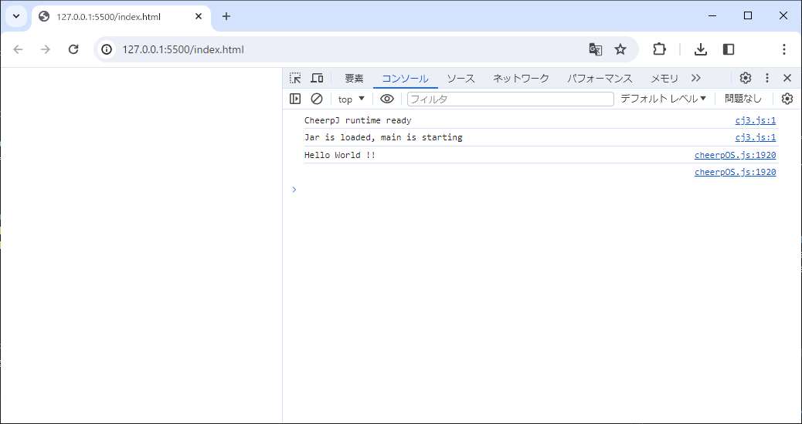

# webassembly_java_CheerpJ_3.0_example1

## 概要
以下を試してみる

[CheerpJ](https://cheerpj.com/)  
最新のブラウザ用の完全なJavaランタイム  
CheerpJ は、大規模な未変更の Java アプリケーション、アプレット、ライブラリをブラウザで実行できる唯一のソリューションです。ダウンロードやプラグインは必要ありません。

[WebAssemblyでOpenJDKのJavaランタイムを実装、JarファイルをそのままWebブラウザで実行できる「CheerpJ 3.0」正式リリース](https://www.publickey1.jp/blog/24/webassemblyopenjdkjavajarwebcheerpj_30.html)  

## 詳細

### HelloWorld.jar を作る

[Linux環境でjarファイル作ってhello worldする](https://7me.nobiki.com/2017/java-hello.html)

jar 作る
```
javac --release 8 HelloWorld.java
jar cvfm HelloWorld.jar mani.mf HelloWorld.class
```

実行してみる
```
java -jar HelloWorld.jar
```
出力
```
Hello World !!
```

### index.html を作る

```html
<!doctype html>
<html lang="en">
  <head>
    <meta charset="utf-8" />
    <script src="https://cjrtnc.leaningtech.com/3.0/cj3loader.js"></script>
  </head>
  <body>
    <script>
      (async function () {
        await cheerpjInit();
        await cheerpjRunJar("/app/HelloWorld.jar");
      })();
    </script>
  </body>
</html>
```

### index.html を実行
※vscode の拡張機能の [Live Server](https://marketplace.visualstudio.com/items?itemName=ritwickdey.LiveServer) を利用



## 環境
Windows 10 x64  
Version 10.0.19045.3930 
```
> java --version
openjdk 17.0.1 2021-10-19
OpenJDK Runtime Environment (build 17.0.1+12-39)
OpenJDK 64-Bit Server VM (build 17.0.1+12-39, mixed mode, sharing)
```